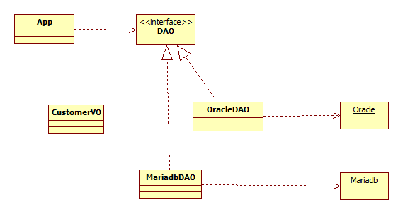

# Java Learning

- 하루동안 Java에 대해 학습한 내용을 기록한다.

  

## 프로그램 및 사용 자료

1. 멀티캠퍼스 [14회차] AI플랫폼을 활용한 웹서비스 개발' (2022-04-04 ~ 2022-08-19)

   - 교과서 기반 기본수업

     

## 개요

1. 

7장. 상속 (Inheritance)

​	8. [추상 클래스 (Abstract Class)](#Abstract) - p 329

8장. [인터페이스 (Interface)](#Interface) - p 344


## 날짜

- [Day01](./day01) - 2022-04-04
- [Day02](./day02) - 2022-04-05
- [Day03](./day03) - 2022-04-06
- [Day04](./day04) - 2022-04-11
- [Day05](./day05) - 2022-04-12
- [Day09](./day09), [Day10](./day10) - 2022-04-20
  - [Abstract class](#Abstract)
  - [Interface](#Interface)


---

###  Abstract

 - **Abstract**: 실체들 간에 **공통되는 특성**을 추출한 것
   - 새, 곤충, 물고기 -> 동물 (추상)
   - 삼성, 현대, LG -> 회사 (추상)


- **Abstract class (추상 클래스)**

  - 실체 클래스들의 공통되는 필드와 메소드를 정의한 클래스 (일반 함수 쓰기 가능)

  - 추상 클래스는 실체 클래스의 부모 역할 -> 객체 생성 불가

  - 용도:

    - 실체 클래스의 공통된 필드와 메소드의 이름을 통일할 목적

    - 정리정돈: Heterogeneous Collection과 같이 라인 하나에 다양한 타입의 개체들의 동일한 

      행위를 실행할 수 있어서 효율성이 높음

      

- **Abstract class의 선언**

  ```public abstract class```

  

- **Abstract Method와 Overriding (재정의)**

  - Abstract class에 Abstract method를 정의한 후 하위 클래스에서 Overriding(재정의)한다.
  - => Polymorphism (다형성) 
    - 동물은 소리를 낸다. --> 실체 동물들의 소리는 제각기 다르다. 
  - 추상함수가 있다면 그 클래스는 추상클래스여야 한다.
  - 추상 클래스여도 실제로 사용할 수 있는 함수를( 하위 클래스의 공통 기능) 쓸 수 있다


+ **UML: Generalization**

(그림)


day09/shape.java


-----


- simCar 코딩

  ----

  

- UML Oracle 

  - User라는 단어는 클래스 네임으론 지양하자 - 예약어이다.
  - *App에서 유저정보를 받아서 oracleDAO(data access obj)에 넘겨주면(CustomerVO(value obj)에 정보를 담아서 던져준다) oracleDAO가 Oracle이라는 데이터베이스에 넣는다.


이러한 방식은 지양해야한다. database에 depend하는 방식 -> db를 바꾸면 정신 사나워짐


CustomerVO 뭉탱이로 보낼때 - 배운 것 중에선 배열- 하지만 현업에서는 배열을 거의 안씀(왜냐하면 배열은 사이즈를 지정해야 하기 때문에)

--> Test.java ---> ArrayList (사이즈 자유 조절)


- 지금 만든 JAVA파일은 현재  APP과 OracleDAO가 붙어있어서 레고처럼 꼈다 뺏다 할 수 없다

  -> 하나 수정하려면 둘 다 수정해야함 

  -> 그래서 인터페이스가 필요 두개를 떼어내기 위해

- 어떤 프로그램이 누군가와 접속을 한다는 것은 상당히 복잡한 아키텍처로 되어있다.

  - Scanner를 통해서 화면에서 입력된 값을 가져오는 것 -> 접속을 하면 무조건 close해줘야 한다.
  - **접속이라는 과정 필요 -> 데이터 insert 후에는 close라는 과정이 반드시 필요 (Open & close)

---

### 


- 8장: interface p345 package, Interface UML

- 

  

- uml : mariadbDAO(connected to Mariadb)랑 interface 연결했다가 OracleDAO(Oracle) 연결했다가

---

## 8장

### Interface

- 인터페이스란 무엇인가
- 인터페이스의 구현
- 인터페이스의 사용
- 타입변환과 다형성
- UML




​																										*VO: Value Obj.

​																										*DAO: Data Access Obj.

- **인터페이스**

  - 인터페이스는 기능만이 정의 되어 있는 껍데기이다.

    - 객체(App)에는 필요한 기능만 정의되어 있다.

    - 그 기능의 내용은 개발코드(Class DAO)에 쓰여 있다.

      

- **인터페이스의 역할**

  - *인터페이스: **객체**(APP)**와 개발 코드**(oracleDAO)**가 서로 연동하는 접점**

  - App과 DAO는 둘 다 인터페이스에 맞게 설계된다 

    -> app과 dao는 만난적도 없지만 같은 규격을 보면 설계되었기 때문에 

    ​	서로 퍼즐처럼 맞아 떨어진다.

    

  - 인터페이스가 있으면 시스템이 바뀌어도 객체나 개발코드 한 부분만 바꿀 수 있기 때문에

    잘 만들어놓으면 시스템이 상당히 유연해진다 

    - Oracle에서 Mariadb로 바뀔 때, DAO만 바꿔주면 된다.

  - 전체적으로 시스템이 엮여 있을 때는 모든 것을 다 바꿔야하기 때문에 

    interface는 거의 필요불가결의 것이다.

    

- **인터페이스의 구현**

  - 선언

    - 상수 - 많이 들어가진 않음
      - ```public static final``` (일반 변수 사용 x) - 값을 저장하는 '필드'가 아님.

    - *Abstract Method (추상 메소드) - 주로  
      
      - 개발 정의 (```abstract``` keyword 생략)
      
    - Default Method (디폴트 메소드) - 주로 
      - 자바8에 새롭게 추가된 기능. (원래는 안됐지만- 인터페이스는 기능만 있어야 했어서)
      - ```default``` keyword 사용 - access modifier 아님

    - 정적 메소드(Static) - skip

      

  - 사용 

    - 실제 클래스를 만들어서 인터페이스를 상속받고 추상메소드들을 재정의한다. (in OracleDAO)

    - 실제 클래스에서 implements 인터페이스명을 씀

      - ```OracleDAO implements DAO```

    - 인터페이스에서 쓰여진 추상메소드 선언을 정확히 따라서 작성

      

- **타입변환과 다형성 (Polymorphism)**

  - 다형성이라는 것이 자연스럽게 표현되고 있다.

  - OracleDAO와 MariadbDAO처럼 바꿔 끼어넣어서 Interface의 함수를 Override하면 됨.

  - 자바 상속은 하나 밖에 안 되지만 인터페이스는 기능을 정의한 것이기 때문에 

    여러가지 인터페이스 상속가능

  

- **UML**

  - 점선 - DirectedAssociation (Loose Coupling)
  - 실선 - Dependency (Tight coupling) 
  - 클래스  상속 - Generalinze
  - 인터페이스 상속 - Realization

  

---

PACKAGE p346 데이터 저장 구현

- ArrayList()

- HashMap

  